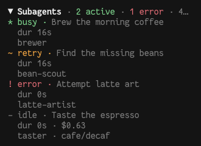

# opencode-subagent-watch

OpenCode TUI plugin for monitoring subagent activity.

The built-in view is fine for short-lived subagents.
When several run at once, it is easy to lose track of them.
This plugin adds a sidebar panel that keeps recent subagents visible at a glance.



Example states:

```text
* busy · Locate authentication flow
  grep 8s ago                     dur 2m
  explore
~ retry · Fix flaky tests
  dur 40s
  builder
! error · Review patch
  dur 43s · $0.03
  reviewer
- idle · Map API routes
  $0.63
  general · openrouter/deepseek-v3.2
```

Tested with OpenCode 1.18.9.

## Why create this slop?

I'm on the verge of switching to the Pi harness,
but don't want to rebuild what OpenCode already provides right now.

## Why would I install this over a bajillion other vibe-coded plugins out there?

This plugin is minimal in all aspects, and I will keep it that way.

```shell
$ du -sh dist/
 36K    dist/
```

Also, no dependencies, ever.

## Install

<!-- x-release-please-start-version -->

Install:

```shell
opencode plugin --global opencode-subagent-watch@0.3.0
```

Upgrade:

```shell
opencode plugin --global --force opencode-subagent-watch@0.3.0
```

<!-- x-release-please-end -->

Restart OpenCode after installation or upgrade.

## Local development

Requires:

- [Bun](https://bun.com/)
- [OpenCode](https://opencode.ai/)

Install dependencies and build:

```bash
bun install
bun run build
```

Test the built plugin from either OpenCode config scope:

- Global config: `~/.config/opencode/tui.jsonc`.
- Project config: `tui.json` in the project root.

Append the absolute path to the `plugin` array:

```json
{
  "plugin": ["/absolute/path/to/opencode-subagent-watch/dist/tui.js"]
}
```

OpenCode loads TUI plugins at startup. Rebuild and restart after each source change:

```bash
bun run build
```

## Checks

- `bun run precommit`: format, lint, typecheck, and test.
- `bun run check`: check formatting, lint, typecheck, test, build, and package.

Preview all sidebar states with the local demo provider:

```bash
bun run demo
```

Run `/demo` command, it will spawn deterministic subagents.

For plugin load diagnostics:

```bash
opencode --print-logs --log-level DEBUG
```

## Disclaimer

This project is provided as-is, without warranty or guarantee of compatibility, reliability, or continued maintenance. It is not affiliated with or endorsed by OpenCode.

The initial code was generated with GPT-5.6 Sol.

## License

[MIT](LICENSE)
